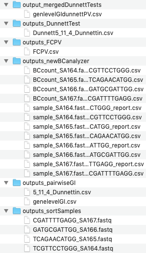

# CombiPIPE
Analysis pipelines for combinatorial screens done using the CombiGEM-CRISPR and CombiSEAL (coming soon) platforms.
## Before running
Please install DescTools on RStudio. Then go to terminal (any command line window) and install regex, scipy, and numpy for python. If python3, simply use pip3 instead of pip.
```
pip install regex
pip install scipy
pip install numpy
```
Please install nextflow
```
curl -s https://get.nextflow.io | bash
export PATH=$PATH:</path/to/file>
```
Download JDK 8 from [here](https://www.oracle.com/java/technologies/javase-jdk8-downloads.html)
A dmg or exe file serves well. Open once downloaded, then follow the instructions on the installer.
```
export JAVA_HOME=$(/usr/libexec/java_home -v 1.8)
```
Generate a sample info. csv file containing sample index sequences, sample names, and conditions:
```
GATCAATGTTC,SA162,1
CGATCTGGCGAA,SA163,1
TCGTTCCTG,SA164,0
ATCAGAACAT,SA165,0
```
Generate a barcode csv file containing the barcodes and keys:
```
AAGCGAGT,1
CTCTAGGT,2
```
## Running the pipelines
The first three processes are the same in both pipelines.
1. extract samples
2. extract barcodes
3. calculate lg Fold Change and -log10 P value between the initial and experimental group.
#### For CombiGEM (This pipeline supports pairwise screens only)
4. calculate gene-level genetic interaction
5. calculate Dunnett test p-values for each gene-level combinations
```
nextflow CombiGEM.nf \
      --fastq <fastq> \
      --sampinfo <sampleInfo.csv> \
      --barcodes <barcode_list.csv> \
      --pattern <1st 7 letters from the fastq file> \ 
      --dimensions <number of gRNAs> \ 
      --linker <barcode-connecting sequence>
      --linker <dummy sgRNA names separated by "," (e.g.: 1,2)>
```
#### For CombiSEAL (coming soon)
4. epistasis calculation (based on FACS sorting data)

## Try running the pipeline with the test-dataset
The test dataset is a minimal dataset that contains 3 percent of all reads from the ovarian cancer 3-way analysis described in the [Cell Reports study by Zhou et al.](https://www.cell.com/cell-reports/fulltext/S2211-1247(20)31005-6#secsectitle0070)
1. clone/download this directory to your computer
2. get to the downloaded directory from your command line window
3. type `gunzip test-dataset/OVARIAN_testdataset.fastq.gz`
4. run the pipeline with nextflow by typing the following:
```
nextflow CombiGEM.nf --fastq test-dataset/OVARIAN_testdataset.fastq --sampinfo test-dataset/sampleInfo.csv --barcodes test-dataset/barcode_list.csv --pattern @D00691 --dimensions 3 --linker CAATTC --dummysgs 1,2
```
#### If ran successfully, these are what you will see:



## Publications
#### CombiGEM-CRISPR
1. https://www.nature.com/articles/nbt.3326
2. https://www.pnas.org/content/113/9/2544.short
3. https://www.cell.com/cell-reports/fulltext/S2211-1247(20)31005-6#secsectitle0070
#### CombiSEAL
1. https://www.nature.com/articles/s41592-019-0473-0
